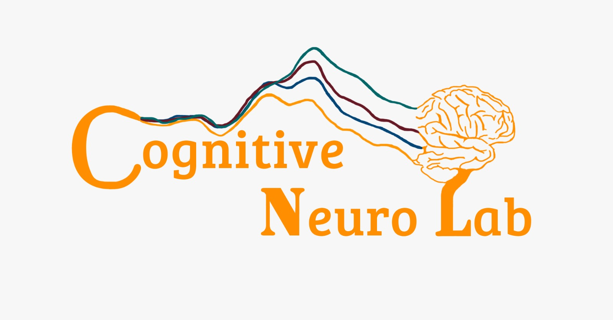

[![Contributors][contributors-shield]][contributors-url]
[![Forks][forks-shield]][forks-url]
[![Stargazers][stars-shield]][stars-url]
[![Issues][issues-shield]][issues-url]
[![MIT License][license-shield]][license-url]


<br />
<p align="center">
  <a href="https://github.com/CognitiveNeuroLab/Speech-in-noise-pipeline/">
    
  </a> 

<h3 align="center">Speech-in-noise pipeline</h3>

<h4 align="center">This repo will have a pipeline for pre-processing and doing stats on SiN data. In this repo will be code that has been in the lab for some year, I am not sure who made the code, but it works. </h4>


**Table of Contents**
  
1. [About the project](#about-the-project)
3. [What is in this repo](#what-is-in-this-repo)
  - [Pre-processing](#pre-processing)
3. [License](#license)
3. [Contact](#contact)
3. [Acknowledgement](#acknowledgement)
3. [Usage](#usage)


<!-- ABOUT THE PROJECT -->
## About The Project

This is a pipeline that has the pre-proccessing scripts on how to analyse SiN data. We might add either an R-script or screenshots from SPSS on how to do stats.


## What is in this repo

To pre-process the data, you need the following things:
1.  The wordlist: This contains all the correct answers 
2.  The logfiles from the participant: we need these because these have all the noise levels that presentation assigned
3.  The participant's reponse file: this is the excel file with the reponses from the participant.
4.  The Sin_sorting_files script: this is the main matlab script to analyse the data with
5.  The importPresentationLog function: to import Logfiles*

*there are currently wait to import logfiles without this extra function build in to matlab. But since this exists and works we still use this for the script

**We might add statistics on a later stage** - This wil either be an R-script or explain in steps in the Readme.

### Pre-processing
To preprocess the data you need to make sure that the data is in good order. This means the following:  
1.  look for empty logfiles. 
    - A lot of participants will have more than 15 logfiles, this can be cause due to starting the scenario file in presentation too early or while the particpant wasn't ready or a lot of other reasons. You need to delete the empty ones and look fo the ones that are bigger or equal to 3 KB in size. After deleting the smaller files you need to re-do the count in which the files end, so that it's again 1-15. 
2.  Make sure all the logfiles have the same date and same ID. It is also possible that the ID that is in the name of the logfile doesn't match the one when you open the logfile. 
3.  Check if there are 20 responses in the excel file. Often people included the first stimulus which was a practice leading to 21 responses. In this case you can delete the first row. **20 responses equals 21 rows in excel**
4.  Update the Sin_sorting_files script.Change the following code
``` Matlab
subject_id={'TheIDBeforeTheLogfiles'};
subject_name=subject_id;
name_sin_logfile = '-speech_and_noise_kids_'; 
Raw_response_file={'TheNameOfTheExcelResponseFile.xlsx'};
dir='FilePathToTheData\';
```
To something similar to:
```matlab
subject_id={'Test_Subject'};
subject_name=subject_id;
name_sin_logfile = '-speech_and_noise_kids_'; 
Raw_response_file={'Test_subject-sin.xlsx'};
dir='C:\Users\dohorsth\Documents\GitHub\Speech-in-noise-pipeline\test\testsubject\';
```
5.  Check the "subjectID"_compileddata.xlsx file
    - First make sure it has 300 responses. If it has more, you probably have too many responses in your excel response sheet.
    - Check if there are any "200" or "3" codes. "200" happens when the experimenter clicked inbetween stimuli (I think), we added code to solve this for most cases, but didn't want to create the possibilty for using the next noise level by mistake. "3" == "200" except that it only happens for the first 20 words, the rest all will have 200.
    - Check for homonyms or other words we decicided can be corrected. If you open the "homonyms" document you will find the words that we have substituted. This is done because there is no way to hear the difference so we cannot say if it's wrong by the participant or even the interpertation of the experimenter. 
        - If you do this, make sure to also add the noise level to the column for correct responses.
6. Use SPSS to create the final data.
    - Select everything but the headers from column D and E. Copy this into SPSS.  
    
    - In SPSS select "Descriptive Statistics" --> "Frequencies..."  
    
    - copy from the first spss frequency table the first and second column, to column G and H in excel.  
    
    - Do the same for the second frequency table, but make sure that you skip what you need to skip (in the example there are not correct responses for 17.00).  
    
    - Add everything to excel and calculate correct percentages. You can use the formula: =(I2/H2)*100 and pull it down.  
    
7. repeat for each individual dataset.

<!-- LICENSE -->
## License

Distributed under the MIT License. See `LICENSE` for more information.


<!-- CONTACT -->
## Contact

Douwe - douwehorsthuis@gmail.com

Project Link: [https://github.com/CognitiveNeuroLab/Speech-in-noise-pipeline/](https://github.com/CognitiveNeuroLab/Speech-in-noise-pipeline/)


<!-- ACKNOWLEDGEMENTS -->
## Acknowledgements

* Lars Ross (who ran the original SiN studies)
* Victor DelBene (who help explaining the scripts)


[contributors-shield]: https://img.shields.io/github/contributors/CognitiveNeuroLab/Speech-in-noise-pipeline.svg?style=for-the-badge
[contributors-url]: https://github.com/CognitiveNeuroLab/Speech-in-noise-pipeline/graphs/contributors
[forks-shield]: https://img.shields.io/github/forks/CognitiveNeuroLab/Speech-in-noise-pipeline.svg?style=for-the-badge
[forks-url]: https://github.com/CognitiveNeuroLab/Speech-in-noise-pipeline/network/members
[stars-shield]: https://img.shields.io/github/stars/CognitiveNeuroLab/Speech-in-noise-pipeline.svg?style=for-the-badge
[stars-url]: https://github.com/CognitiveNeuroLab/Speech-in-noise-pipeline/stargazers
[issues-shield]: https://img.shields.io/github/issues/CognitiveNeuroLab/Speech-in-noise-pipeline.svg?style=for-the-badge
[issues-url]: https://github.com/CognitiveNeuroLab/Speech-in-noise-pipeline/issues
[license-shield]: https://img.shields.io/github/license/CognitiveNeuroLab/Speech-in-noise-pipeline.svg?style=for-the-badge
[license-url]: https://github.com/CognitiveNeuroLab/Speech-in-noise-pipeline/blob/master/LICENSE.txt
